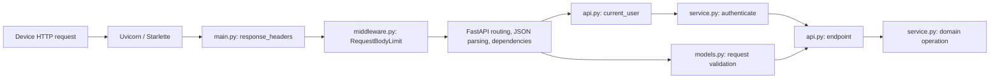

# Execution flow
This describes the implemented modules and call paths, not an aspirational architecture.

## 1. Process startup
1. `python -m app` enters `app/__main__.py`.
2. Uvicorn is configured for `0.0.0.0`, `PORT` (default 8000), and one worker, then loads `app.main:app`.
3. Importing `app/main.py` calls `create_app()`. `Settings.from_environment()` in `app/config.py` resolves the database path and validates Railway persistence requirements.
4. `create_app()` constructs `Database` and `SyncService`, puts them on `application.state`, registers middleware/error handlers, and includes the router from `app/api.py`.
5. Before requests are served, the lifespan callback calls `Database.initialize()`. This creates the directory, checks schema version, enables WAL, and initializes the schema transactionally.
6. Only after startup succeeds does Uvicorn serve requests. Railway volumes must already be mounted at this point.

There is no database server, job queue, background sync worker, or frontend process. The synchronous API functions run in FastAPI's worker thread pool. Each service operation opens and closes its own SQLite connection.

## 2. HTTP entry and validation

The body limiter checks declared length and counts actual streamed bytes, buffering at most 256 KiB before forwarding. Non-HTTP lifespan traffic passes through.

For protected routes, `current_user()` obtains an HTTP bearer credential and calls `SyncService.authenticate()`. That hashes the credential, reads `users.token_hash` in a read transaction, and returns the authenticated `user_id`. Clients do not submit an authoritative user ID.

FastAPI parses the body and resolves dependencies/validated models before entering the endpoint. JSON parsing can reject malformed bodies before authentication dependencies complete; there is no promise that every invalid body returns an authentication error first. Neither authentication nor validation performs a document mutation.

`models.py` rejects unknown fields, wrong scalar types, null/empty patches, invalid UUIDs, invalid Unicode, out-of-range versions, and invalid tags. Query/path validation bounds pagination and versions.

## 3. Workspace and device setup
- `POST /v1/users` → `api.register_user()` → `SyncService.register_user()`. Generate a random bearer token, store its hash in a write transaction, and return the plaintext token once.
- `PUT /v1/devices/{device_id}` → authentication → `api.register_device()` → `SyncService.register_device()`. Upsert that user's device/name in a write transaction, preserving its creation timestamp.

Registration does not use the mutation idempotency cache. Device registration is naturally idempotent through its scoped primary key.

## 4. A sync request
`POST /v1/sync` enters `api.synchronize()` and calls `SyncService.sync(user_id, body)`.

`sync()` constructs its operation callback and passes it to `_run(user_id, "sync", request, callback)`. **The callback is not executed before the transaction lock is acquired.**

### Shared mutation transaction: `SyncService._run()`
1. Normalize the validated payload and operation into canonical sorted-key JSON.
2. Compute its SHA-256 fingerprint.
3. Enter `Database.transaction(write=True)`, which opens a configured connection and executes `BEGIN IMMEDIATE`.
4. Look up `(user_id, request_id)` in `requests`.
   - Same fingerprint: load the stored status/body, mark it replayed, and skip the operation.
   - Different fingerprint: return `idempotency_key_reused`; do not alter the original cache entry.
5. Check that the submitted device belongs to the user. If not, prepare a stable `device_not_found` rejection.
6. Establish a mutation savepoint and execute the callback. A handled `Problem` rolls back to the savepoint and becomes a cached domain rejection. An unexpected exception propagates and rolls back the complete transaction.
7. Insert the resulting status/body/fingerprint into `requests`.
8. Exit the database context: commit on success, otherwise roll back; always close the connection.
9. Only after successful commit does the endpoint's `response()` build a `JSONResponse`, including `Idempotency-Replayed`.

### The sync callback
1. Read the user's current document.
2. With `base_version=0`, require a nonexistent document and a title. Apply defaults, then create version 1.
3. With a positive base, reject missing documents or versions ahead of the current version.
4. Load the immutable base snapshot from `revisions`.
5. Call `three_way_merge()` in `app/merge.py` with base data, current data, and only the explicitly supplied patch fields.
6. If fields conflict, insert a row in `conflicts` containing the entire original proposal and the three-way comparison. Do not update the current document or revisions.
7. If compatible, call `changed_fields()` to compare the candidate with current data.
8. If different, call `_save()`; otherwise retain the existing snapshot and version.
9. Return an accepted/merged/conflict/rejected result to `_run()` for durable response storage.

### Saving a real state change: `_save()`
`_save()` validates the complete candidate, assigns `current.version + 1` (or 1), timestamps it, updates/inserts `documents`, and inserts the matching immutable `revisions` row. Both writes use the existing transaction. The revision insertion assigns the monotonic change-feed sequence and records device, request, kind, base version, and optional restore source.

No commit occurs inside `_save()`. A failure while storing the later idempotency response undoes both document and revision writes.

## 5. Conflict inspection and resolution
`GET /v1/conflicts/{id}` → `SyncService.get_conflict()`:
- Open one read snapshot transaction.
- Load the scoped conflict, its original base revision, and the latest document.
- Re-run the merge comparison. Return both `original_conflicts` and refreshed `current_conflicts`, plus the saved proposal and both snapshots.

`POST /v1/conflicts/{id}/resolve` → `SyncService.resolve()` → `_run()` with operation identity `resolve:{id}`:
1. Load the scoped conflict; require it to be open.
2. Read the current document under the same write lock.
3. Require `expected_version == current.version`.
4. Recompute the original proposal against the original base and latest server values.
5. Require exactly one server/client choice for each conflict that exists **now**.
6. Begin with current data plus safely mergeable original fields. Apply a conflicting proposed value only for a deliberate `"client"` choice.
7. Append a `resolved` revision only if data changed.
8. Mark the conflict resolved with its resolution request ID/time.
9. Persist the response and commit everything together.

A second resolver with a different request UUID sees a closed conflict; an identical network retry sees its original cached success. An intervening accepted edit triggers a version mismatch before any resolution writes.

## 6. Restoring a saved version
`POST /v1/documents/{id}/restore` → `SyncService.restore()` → `_run()` with `restore:{id}`:
- Require the current version to match `expected_version`.
- Load `target_version` from the user's immutable history.
- If the data differs, call `_save()` with `kind="restored"` and `restored_from=target_version`.
- Keep every existing revision; never decrease or reuse the current version.
- Persist the outcome in the same transaction. Identical data is an accepted no-op.

## 7. Reads and pull synchronization
Authenticated GET endpoints call read methods directly, not `_run()`.
- `get_document()` reads `documents`.
- `list_documents()` keyset-pages current rows by document UUID.
- `get_revision()` reads a single immutable row.
- `history()` pages immutable revisions by document version.
- `changes()` pages immutable revisions by global sequence, filtered by authenticated user.

Each read uses `Database.transaction(write=False)` and `BEGIN` for a consistent snapshot within that response. Queries fetch `limit + 1` rows to determine `has_more`; only `limit` are returned. Cursors advance to the last returned row, not the last row elsewhere in the database.

The change feed returns the saved revision's data, not the latest document data. A later write therefore cannot change an already downloaded historical page. Only real accepted document changes appear in the feed.

## 8. Concurrency, errors, and the response path
SQLite's write lock, not a per-process Python mutex, serializes the critical decision window. A competing request can authenticate/read while WAL is active, then waits for its turn at `BEGIN IMMEDIATE` and rechecks the now-current state.

`Database.transaction()` catches exceptions, rolls back, and closes its connection. Handlers in `main.py` map:
- `Problem` → a structured domain/authentication error.
- `RequestValidationError` → 422 with sanitized field error details, excluding submitted input values.
- SQLite busy/locked errors → 503 plus `Retry-After: 1`.
- Other SQLite operational errors → 503 without leaking storage details.
- Unexpected errors → 500, server-side logging, no internal details in the response.

Normal/error responses traverse `response_headers()` on the way out, adding no-sniff/referrer headers and disabling API caching. Unexpected errors are handled by Starlette's outer error handler; that handler explicitly sets `Cache-Control: no-store` itself.

The server commits before sending the HTTP response. If the network fails after commit, the retry loads the saved response. If failure occurs before commit, the mutation and its response record roll back together.

## 9. Verification entry points
- `tests/test_merge.py`: exhaustive three-value merge truth table.
- `tests/test_sync.py`: creation, stale edits, field conflicts, no-ops, and idempotency.
- `tests/test_resolution.py`: explicit choices, intervening edits, restore, and endpoint-scoped fingerprints.
- `tests/test_api.py`: API validation, identity isolation, docs/favicon, and pagination.
- `tests/test_consistency.py`: independent app instances, synchronized races, restart persistence, busy locks, and injected rollback failures.
- `tests/test_configuration.py`: database pragmas, Railway persistence checks, schema safety, and streamed-body enforcement.
- `scripts/demo.py`: the same public protocol over a real HTTP socket, including a Railway HTTPS URL.

## 10. The deployed request path
The verified public service is `https://sync-api-production-6fe8.up.railway.app`.

An HTTPS request reaches Railway's edge, which routes it to the `sync-api` service's assigned `PORT` (8080 in the observed deployment). Uvicorn then follows the entry/authentication/transaction paths described above. The container runs the code installed from the root `Dockerfile`. SQLite reads and writes `/data/sync.db` on the attached persistent volume, not the disposable application image.

`scripts/railway-service.graphql` configures the actual service readiness and single-replica settings. Railway waits for `/healthz` before marking the deployment healthy. No schema work runs before the volume is mounted.

The real restart verification observed application shutdown and a new startup with the volume remounted. A subsequent HTTPS read returned the same document and history, and resubmitting the original creation request returned its saved HTTP 201 with `Idempotency-Replayed: true`. This verifies that the critical transaction records are on the persistent volume.

## 11. Running the provided tests against the deployed API
`tests/conftest.py` registers `--base-url` and `--allow-live-writes`. `pytest_configure()` validates the target and write opt-in, requires HTTPS for external hosts, and rejects misleading remote coverage collection.

Before fixture setup, `pytest_collection_modifyitems()` marks every `local_only` test skipped in live mode. This prevents temporary-database manipulation, fault injection, or an in-process restart from being mistaken for a production test.

For each remaining test, the `client` fixture creates an `httpx2.Client` pointed at the supplied origin. It does not enter a local `TestClient` or request the local app/database fixture. The `workspace` fixture registers a uniquely named verification workspace and two random devices through the real public API; existing test assertions then follow the deployed request path in section 10.

`peer_client` opens a second real HTTP client with the same test-workspace authorization for concurrency checks. Both clients reach the production service; creating this second client does not restart it. In default local mode, the fixture instead creates a second in-process app sharing the temporary SQLite database, preserving the original concurrency tests.

The verified live invocation ran 77 HTTP cases successfully and skipped 45 local-only cases. `.tools/production-tests.xml` records the machine-readable result. All 122 cases separately passed in default local mode. Live test data remains within the newly created verification workspaces; the runner has no deployment/restart operation or production SQL access.
